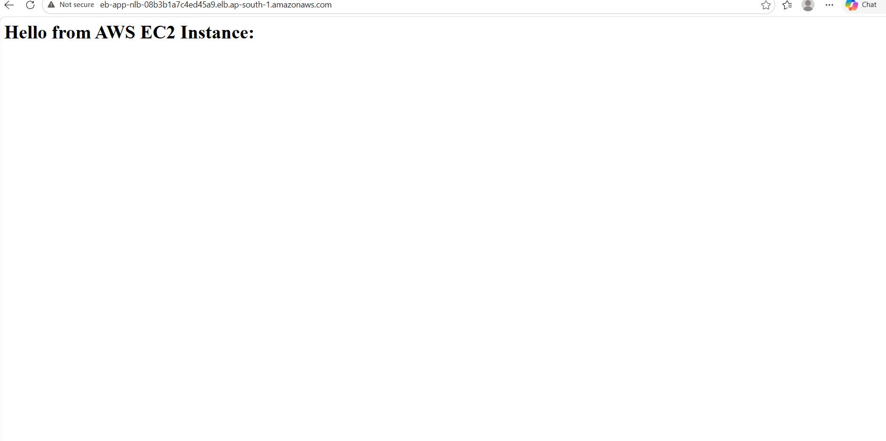
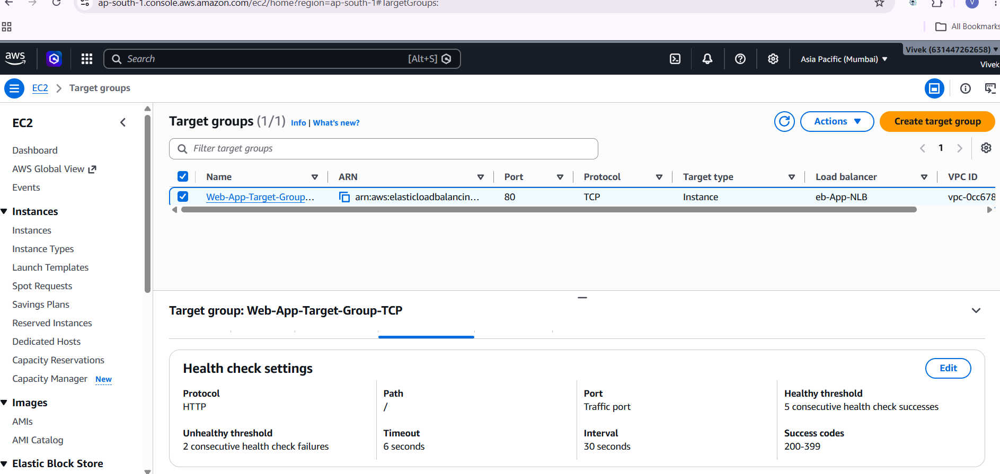
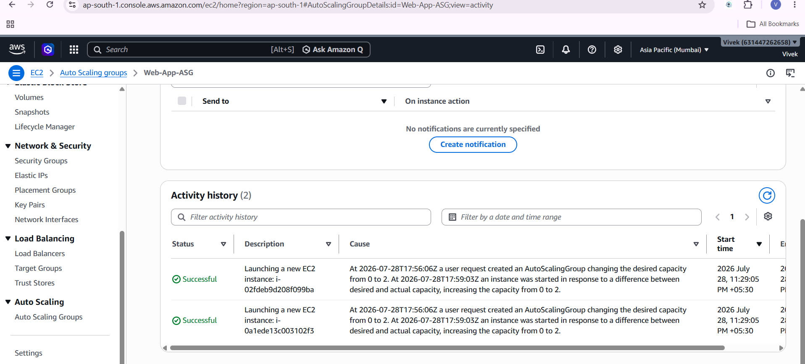
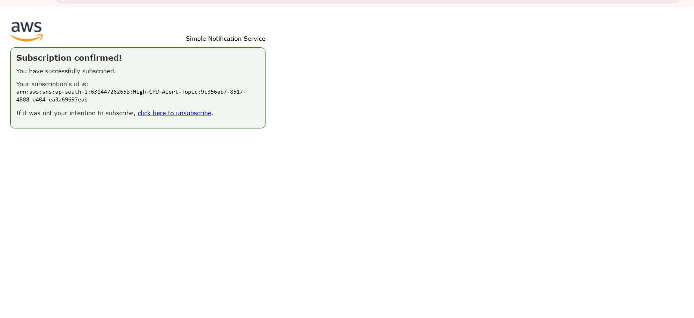
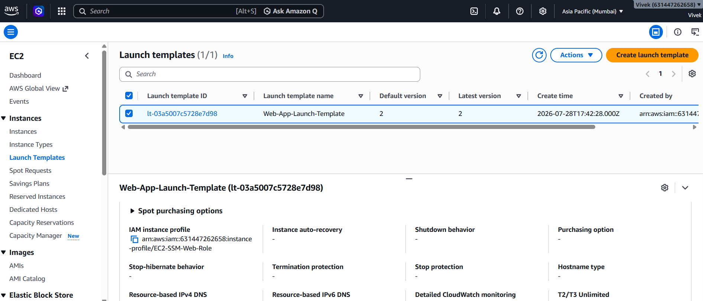

# AWS Scalable Web Application with NLB & Auto Scaling Group

This repository contains the architecture setup, deployment steps, and verification screenshots for an AWS auto-scaling infrastructure using a **Network Load Balancer (NLB)**, **Auto Scaling Group (ASG)**, and **CloudWatch/SNS monitoring**.

---

## 🏗️ Architecture Overview

* **Network Load Balancer (NLB):** Distributes incoming TCP traffic to healthy web server instances across multiple Availability Zones.
* **Auto Scaling Group (ASG):** Automatically adjusts capacity based on CPU utilization metrics.
* **Launch Template:** Defines EC2 configuration with IAM roles attached for secure access.
* **CloudWatch & SNS:** Monitors CPU utilization and triggers email alerts when scaling thresholds are reached.

---

## 📸 Architecture Screenshots & Verification

### 1. Web Application Access via NLB
Verified the web app output using the DNS endpoint provided by the Network Load Balancer.

### 2. Target Group Health Status
Verified that target EC2 instances are healthy and receiving traffic through the TCP Target Group.

### 3. Auto Scaling Group Activity
Verified instance creation and scaling operations in the ASG Activity History.

### 4. CloudWatch Alarm & SNS Notification
Confirmed email subscription for high CPU utilization alerts via Amazon SNS.

### 5. Launch Template & IAM Security
Verified that EC2 instances launch with the proper IAM roles and security parameters attached.

